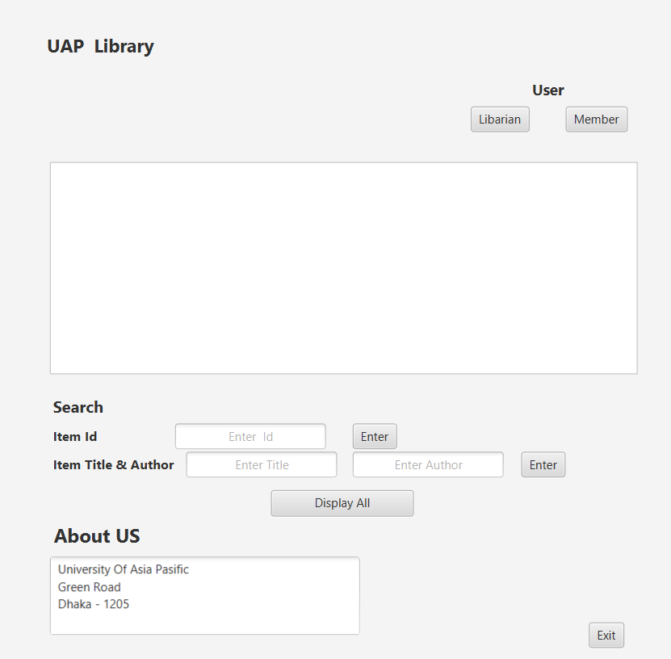
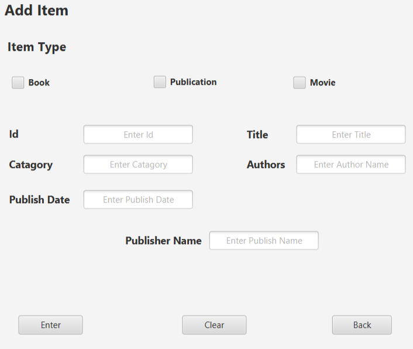

# UAP Library Management System (Java)

This project is a simple library management system developed in Java, utilizing JavaFX and Scene Builder for the user interface. It allows users (both librarians and members) to search for items, add new items, and manage checkouts.

## Overview

This application provides a basic interface for interacting with a library's data. It offers functionalities for managing library items and handling checkout processes. The core features include:

*   **Item Management:** Adding new items (books, publications, movies) with details like ID, title, category, authors, publish date, and publisher.
*   **Search Functionality:** Searching for items by ID, title, or author.
*   **Checkout Management:** Checking out and extending the checkout period for items, as well as displaying checkout records.
*   **User Roles (Planned):** The UI suggests different user roles (Librarian/Member), although authentication is not yet implemented.

## User Interface

The user interface was designed using JavaFX and Scene Builder, allowing for a visual and intuitive design process. The UI consists of several screens:

*   **Main Screen:** Provides search functionality and buttons to navigate to other screens (Add Item, Checkout).
*   **Add Item Screen:** Contains input fields for adding new library items.
*   **Checkout Screen:** Provides functionality for checking out items, extending checkouts, and displaying checkout records.

## How to Run

1.  **Clone the Repository:**
    ```bash
    git clone https://github.com/Apurba0012/library-management-system-JAVA
    ```
2.  **Navigate to the Project Directory:**
    ```bash
    cd library-management-system-JAVA/TestGUI
    ```
3.  **Import into IDE (Recommended):** The recommended way to run this project is to import it into an IDE like Eclipse or IntelliJ IDEA.
    *   **Eclipse:** File -> Import -> Existing Projects into Workspace.
    *   **IntelliJ IDEA:** File -> New -> Project from Existing Sources.
4.  **Resolve JavaFX Dependencies:** Ensure JavaFX is correctly configured in your IDE. You may need to add the JavaFX libraries to your project's classpath or use a build tool like Maven or Gradle to manage dependencies.
5.  **Run the Application:** Once imported and dependencies are resolved, you can run the application directly from your IDE.

## Technologies Used

*   Java
*   JavaFX
*   Scene Builder
*   Eclipse 
## Screenshots

Here are some screenshots of the application:

### Main Screen



### Add Item Screen


